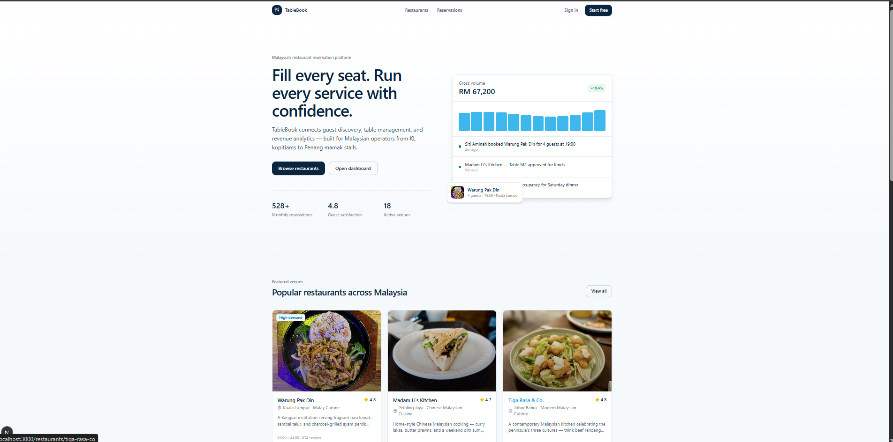
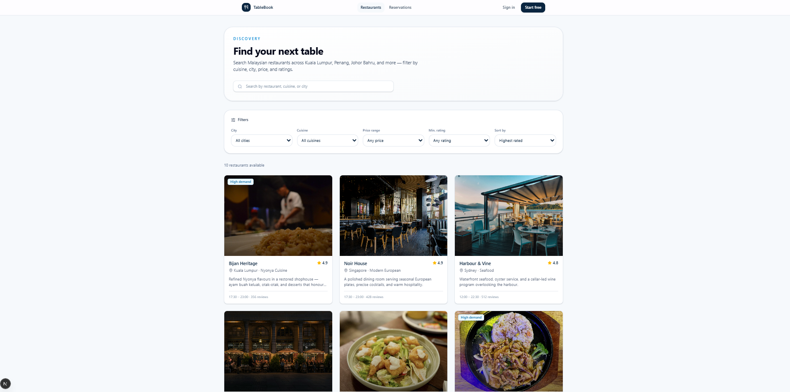
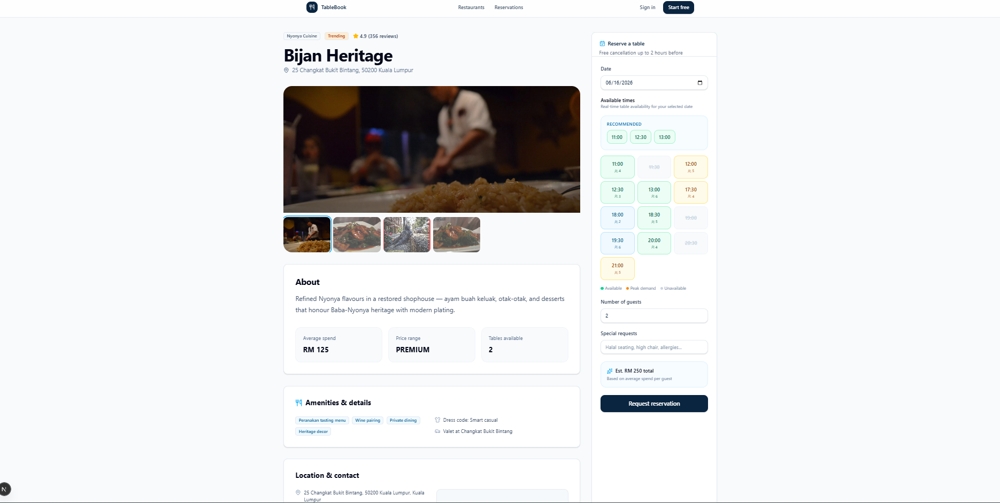
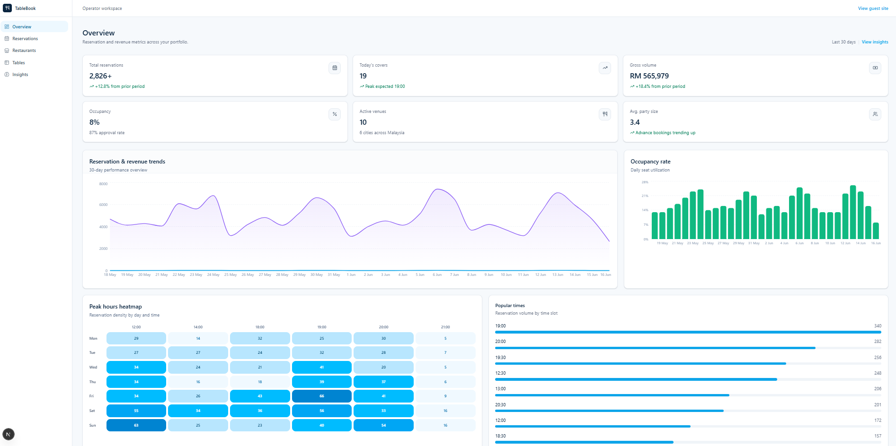

# 🍽️ TableBook

Modern Restaurant Reservation Platform built with Next.js, NestJS, PostgreSQL and AWS.

A production-style full-stack SaaS application that enables customers to discover restaurants, make reservations online, and provides restaurant operators with reservation analytics and management tools.

---

## 🚀 Live Demo

Coming Soon

---

## 📋 Overview

TableBook is a modern restaurant reservation platform inspired by products such as OpenTable and Resy.

The platform allows customers to browse restaurants, check availability, and make reservations while providing operators with analytics dashboards, reservation management workflows, and business insights.

The project was built as a portfolio-quality SaaS application demonstrating modern full-stack development practices using React, Next.js, NestJS, PostgreSQL, and AWS.

---

## ✨ Features

### Customer Features

- User Authentication
- Restaurant Discovery
- Advanced Search & Filtering
- Restaurant Details
- Restaurant Galleries
- Real-time Availability Display
- Online Reservations
- Reservation History
- Reservation Cancellation

### Restaurant Experience

- Malaysian Restaurant Dataset
- Cuisine Filtering
- City Filtering
- Price Range Filtering
- Rating Filtering
- Popular Time Indicators
- Recommended Reservation Slots
- Amenities & Service Information

### Operator Features

- Reservation Management
- Restaurant Management
- Table Management
- Analytics Dashboard
- Occupancy Tracking
- Peak Hour Analysis
- Revenue Monitoring

---

## 🖼 Screenshots

### Landing Page



### Restaurant Discovery



### Restaurant Details



### Analytics Dashboard



---

## 🛠 Tech Stack

### Frontend

- Next.js 15
- React
- TypeScript
- Tailwind CSS
- shadcn/ui
- TanStack Query
- React Hook Form
- Zod

### Backend

- NestJS
- TypeScript
- Prisma ORM

### Database

- PostgreSQL

### Infrastructure

- AWS EC2
- AWS RDS
- AWS S3
- CloudFront

### Authentication

- JWT Authentication
- Refresh Tokens
- Role-Based Access Control

---

## 🏗 Architecture

```text
Frontend (Next.js)

       ↓

REST API

       ↓

Backend (NestJS)

       ↓

PostgreSQL Database

       ↓

AWS Infrastructure
```

---

## 📂 Folder Structure

```text
tablebook
│
├── frontend
│   ├── src
│   ├── components
│   ├── app
│   └── lib
│
├── backend
│   ├── src
│   ├── prisma
│   └── test
│
├── docs
│   ├── landing-page.png
│   ├── restaurant-discovery.png
│   ├── restaurant-detail.png
│   └── admin-dashboard.png
│
└── README.md
```

---

## ⚙️ Installation

Clone the repository:

```bash
git clone https://github.com/Yokota110/tablebook-ai.git
```

### Frontend

```bash
cd frontend

npm install

npm run dev
```

### Backend

```bash
cd backend

npm install

npm run start:dev
```

---

## 🔑 Environment Variables

### Frontend

```env
NEXT_PUBLIC_API_URL=http://localhost:3001
```

### Backend

```env
DATABASE_URL=
JWT_SECRET=

AWS_ACCESS_KEY_ID=
AWS_SECRET_ACCESS_KEY=
AWS_REGION=
AWS_S3_BUCKET=
```

---

## 🗄 Database

Main entities:

### Users

- Authentication
- Customer Profiles
- Operator Accounts

### Restaurants

- Restaurant Information
- Cuisine Types
- Location Data

### Tables

- Capacity
- Availability
- Reservation Assignment

### Reservations

- Booking Details
- Status Tracking
- Guest Management

---

## 📊 Business Analytics

The operator dashboard provides:

- Reservation Trends
- Revenue Tracking
- Occupancy Monitoring
- Peak Hour Heatmaps
- Popular Reservation Times
- Restaurant Performance Metrics

---

## 🌏 Localization

The project includes Malaysian-inspired restaurant data and business workflows.

Examples:

- Kuala Lumpur
- Johor Bahru
- Penang
- Nyonya Cuisine
- Malaysian Dining Concepts

Currency:

```text
MYR (RM)
```

---

## 🎯 Future Improvements

- AI Restaurant Insights
- OpenAI Integration
- Email Notifications
- Payment Integration
- Mobile Application
- Multi-Branch Management
- Customer Loyalty Program

---

## 👨‍💻 Author

**横田 伊春 (Yokota Ishun)**  
Freelance Full Stack Developer · Shiki, Saitama, Japan

After building enterprise web systems and React/Node.js SaaS platforms at Neusoft and Neusoft Reach in China, I have worked as a freelance developer in Japan since 2023, delivering web applications with Next.js, NestJS, PostgreSQL, and AWS.

TableBook is a portfolio project showcasing modern full-stack SaaS development with the same stack.

- **Email:** [richunyokota93@gmail.com](mailto:richunyokota93@gmail.com)
- **GitHub:** [Yokota110/tablebook-ai](https://github.com/Yokota110/tablebook-ai)

**Tech Stack:** TypeScript, React, Next.js, NestJS, PostgreSQL, AWS, Docker

---

## 📄 License

This project was created for portfolio and educational purposes by Yokota Ishun.